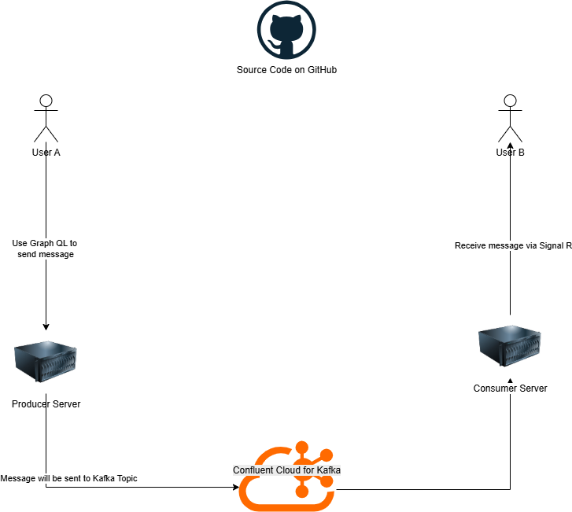
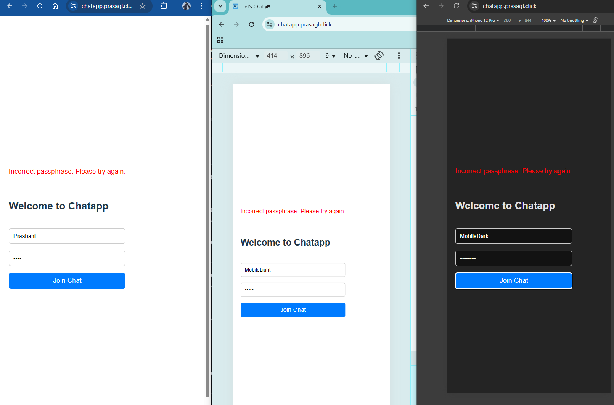
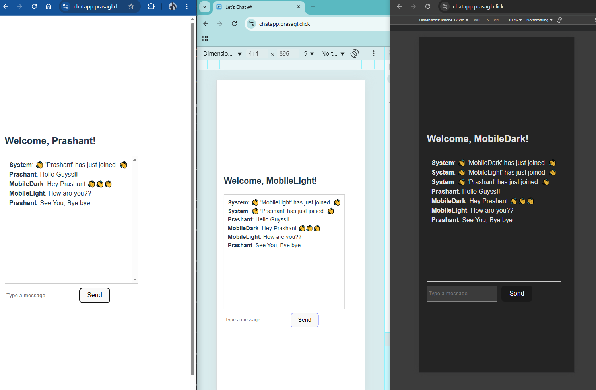

# Chat Application with React, GraphQL, SignalR, and Confluent Cloud  

This project showcases my ability to build a real-time chat application by integrating diverse technologies into a cohesive solution. It highlights my expertise in backend development, cloud infrastructure, and basic frontend implementation.

## Features  
- **Chat Application**: Users can join the chat by entering their name, send messages, and view real-time messages from others.  
- **Two Servers**:  
    1. **Producer Server**:  
         - Publishes messages to Confluent Cloud topics using GraphQL (via the HotChocolate library in C#).  
         - Deployed using AWS App Runner.  
    2. **Consumer Server**:  
         - Subscribes to Confluent Cloud topics and broadcasts messages to all connected clients using SignalR.  
         - Deployed on an AWS EC2 instance.  

## Architecture Diagram  
  

## Prerequisites  
- Node.js (v16 or higher)
- Docker (for building and deploying images)  
- (optional) Confluent Cloud account with API keys  

## Basic Authentication

I have added very basic authentication so that a person will not exploit them. I have done by using `PASS_PHRASE` evironment vairble in my Producer server. 

-  If `PASS_PHRASE` evironment vairble is not set then, application is not secure. User can put any value to enter the app.
- If `PASS_PHRASE` evironment vairble has been setup, then user has to put exact string as environment variable. However, the comparision of password is case insenstive.


## Setup and Installation  
1. Clone the repository:  
    ```bash
    git clone https://github.com/prasnitt/react-graphql-csharp-confluent.git
    cd react-graphql-csharp-confluent
    ```
2. Procucer Server Setup:

     1. Go to following directory
     ```bash
     cd server/GraphQLDemo/GraphQLDemo.API
     ```
     2. Update `appsettings.json` file (E.g. API Key etc)
     3. Run following command to run the server. Y
     ```bash
     dotnet run
     ```
     4. Open  http://localhost:5200/graphql/ link for GraphQL apis

3. Consumer Server Setup:

     1. Go to following directory
     ```bash
     cd server/GraphQLDemo/ChatHub
     ```
     2. Update `appsettings.json` file (E.g. API Key etc)
     3. (optinal) Set an environment variable `PASS_PHRASE` as mention above.
     3. Run following command to run the server. Y
     ```bash
     dotnet run
     ```
     4. Open  http://localhost:5198/ link you will see `Hello World!`, this is just to demonstrate that server is up. However, we are running websocket server at https://localhost:7124/chat-hub

4. Frontend App setup:

     1. Go to following directory
     ```bash
     cd client/chat-app/
     ```
     2. Install dependencies:  
     ```bash
     npm install
     ```
     3. Configure environment variables:  
     - Add your Confluent Cloud API keys and AWS credentials to a `.env` file.  

     4. Start the application:  
     ```bash
     npm run dev
     ```
     5. You will be able to access the app on App 
     6. Note: If you see any CORS related issue fix in `appsetting.json` file of server side and rerun the server.
     6. Put your name on App and Passphrase (as mention above)
     7. And start chatting. You can open multiple windows to test this.

## How It Works  
1. **Producer Server**:  
     - Users send messages via GraphQL, which are published to a Confluent Cloud topic.  

2. **Consumer Server**:  
     - The consumer server listens to the Confluent Cloud topic for new messages and broadcasts them to all connected clients using SignalR.  

## Usage  
- Open the application in your browser.  
- Enter your name to join the chat.  
- Start sending and receiving real-time messages.  

## Technologies Used  
### Primary Learning Goals  
1. **Confluent Cloud**  
2. **GraphQL**  
3. **React** (basic implementation)  

### Additional Tools and Skills  
1. **AWS** 
    
    * `AWS Amplify`: For single-page application deployment (CI/CD).  
    * `AWS App Runner`: For GraphQL server and producer (CI/CD via GitHub Actions by deploying Docker images to ECR).  
    * `EC2`: For the consumer and SignalR-based chat hub (partial CI/CD).  
    * `Route 53`: For DNS management.  
    * `Parameter Store`: For securely storing secrets (e.g., Confluent Cloud API keys).  
    
2. **GitHub Actions** for CI/CD  
3. **SignalR**  
4. **C#**  

## Challenges Faced  
1. **Real-Time Communication**: Implementing SignalR for seamless real-time updates.   
2. **Cloud Integration**: Configuring Confluent Cloud and securely managing API keys.  
3. **CI/CD Pipelines**: Setting up automated deployment pipelines using GitHub Actions and AWS services.  
4. **Setting up an SSL Certificate**: Using Route 53 and ACM (AWS Certificate Manager) was a challenging task.

## Screenshots  

### Login screen on web and mobile  
  

### Chat app interface on web and mobile  
  

## Future Improvements  
If given more time, I plan to:  

1. Backend:  
     1. Refactor the project structure and improve naming conventions.  
     2. Add authentication to restrict access to the app.  
     3. Write unit tests to enhance code quality.  
     4. Use Terraform for Infrastructure as Code (IaC).  
     5. Explore additional improvements as needed.  

2. Frontend:  
     1. Make the code more modular.  
     2. Use the Apollo Client library for GraphQL.  
     3. Add a better CSS library.  

## Contributing  
Contributions are welcome! Please follow these steps:  
1. Fork the repository.  
2. Create a new branch for your feature or bug fix.  
3. Submit a pull request with a detailed description of your changes.  

## Known Issues  
- The application does not currently support user authentication.  
- Frontend styling is minimal and could be improved.
