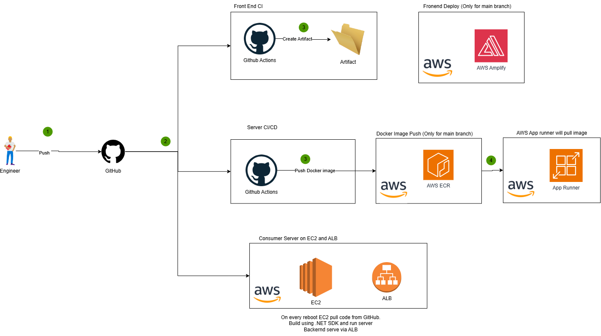

# Chat Application with React, GraphQL, SignalR, and Confluent Cloud  

This project showcases my ability to build a real-time chat application by integrating diverse technologies into a cohesive solution. It highlights my expertise in backend development, cloud infrastructure, and basic frontend implementation.

## Features  
- **Chat Application**: Users can join the chat by entering their name, send messages, and view real-time messages from others.  
- **Two Servers**:  
    1. **Producer Server**:  
         - Publishes messages to Confluent Cloud topics using GraphQL (via the HotChocolate library in C#).  
         - Deployed using AWS App Runner.  
    2. **Consumer Server**:  
         - Subscribes to Confluent Cloud topics and broadcasts messages to all connected clients using SignalR.  
         - Deployed on an AWS EC2 instance.  


## CI/CD  


| Service   | Build Status                                                                 |
|-----------|-----------------------------------------------------------------------------|
| Frontend App CI/CD  | [](https://github.com/prasnitt/JobTracker/actions/workflows/frontend-ci-cd.yml) |
| Backend API CI/CD   | [](https://github.com/prasnitt/react-graphql-csharp-confluent/actions/workflows/react-ci.yml)   |

### CI/CD Flow



## Architecture Diagram  
  

## Prerequisites  
- Node.js (v16 or higher)  
- .NET 8 SDK 
- (optional) Confluent Cloud account with API keys  

## Basic Authentication  

I have added very basic authentication to prevent unauthorized access. This is implemented using the `PASS_PHRASE` environment variable in my Producer server.  

- If the `PASS_PHRASE` environment variable is not set, the application is not secure, and users can enter any value to access the app.  
- If the `PASS_PHRASE` environment variable is set, users must provide the passphrase that matches the environment variable. The comparison is case-insensitive.  

## Setup and Installation  
1. Clone the repository:  
    ```bash
    git clone https://github.com/prasnitt/react-graphql-csharp-confluent.git
    cd react-graphql-csharp-confluent
    ```
2. Producer Server Setup:  

     1. Go to the following directory:  
     ```bash
     cd server/GraphQLDemo/GraphQLDemo.API
     ```
     2. Update the `appsettings.json` file (e.g., API Key, etc.).  
     3. Run the following command to start the server:  
     ```bash
     dotnet run
     ```
     4. Open [http://localhost:5200/graphql/](http://localhost:5200/graphql/) to access the GraphQL APIs.  

3. Consumer Server Setup:  

     1. Go to the following directory:  
     ```bash
     cd server/GraphQLDemo/ChatHub
     ```
     2. Update the `appsettings.json` file (e.g., API Key, etc.).  
     3. (optional) Set an environment variable `PASS_PHRASE` as mentioned above.  
     4. Run the following command to start the server:  
     ```bash
     dotnet run
     ```
     5. Open [http://localhost:5198/](http://localhost:5198/). You will see `Hello World!`, which demonstrates that the server is running. The WebSocket server is available at [http://localhost:5198/chat-hub](http://localhost:5198/chat-hub).  

4. Frontend App Setup:  

     1. Go to the following directory:  
     ```bash
     cd client/chat-app/
     ```
     2. Install dependencies:  
     ```bash
     npm install
     ```
     3. Start the application:  
     ```bash
     npm run dev
     ```
     4. You will be able to access the frontend app at the specific local endpoint (e.g., `http://localhost:5173/`).

## How It Works  
1. **Producer Server**:  
     - Users send messages via GraphQL, which are published to a Confluent Cloud topic.  

2. **Consumer Server**:  
     - The consumer server listens to the Confluent Cloud topic for new messages and broadcasts them to all connected clients using SignalR.  

## Usage  
- Open the application in your browser.  
- Enter your name to join the chat.  
- Start sending and receiving real-time messages.  

## Technologies Used  
### Primary Learning Goals  
1. **Confluent Cloud**  
2. **GraphQL**  
3. **React** (basic implementation)  

### Additional Tools and Skills  
1. **AWS** 
    
    * `AWS Amplify`: For single-page application deployment (CI/CD).  
    * `AWS App Runner`: For GraphQL server and producer (CI/CD via GitHub Actions by deploying Docker images to ECR).  
    * `EC2`: For the consumer and SignalR-based chat hub (partial CI/CD). 
    * `Application Load Balancer`: To route the traffic from EC2 
    * `Route 53`: For DNS management.  
    * `Parameter Store`: For securely storing secrets (e.g., Confluent Cloud API keys).  
    
2. **GitHub Actions** for CI/CD  
3. **SignalR**  
4. **C#**  

## Challenges Faced  
1. **Real-Time Communication**: Implementing SignalR for seamless real-time updates.   
2. **Cloud Integration**: Configuring Confluent Cloud and securely managing API keys.  
3. **CI/CD Pipelines**: Setting up automated deployment pipelines using GitHub Actions and AWS services.  
4. **Setting up an SSL certificate**: Using Route 53 and ACM (AWS Certificate Manager) was challenging.  

## Screenshots  

### Login screen on web and mobile  
  

### Chat app interface on web and mobile  
  

## Future Improvements  
If given more time, I plan to:  

1. Backend:  
     1. Refactor the project structure and improve naming conventions.  
     2. Implement authentication to restrict access to the app.  
     3. Write unit tests to enhance code quality.  
     4. Use Terraform for infrastructure as code (IaC).  
     5. Explore additional improvements as needed.  

2. Frontend:  
     1. Make the code more modular.  
     2. Use the Apollo Client library for GraphQL.  
     3. Add a better CSS library. 
     4. Make responsive (for both Desktop and Mobile)

## Contributing  
Contributions are welcome! Please follow these steps:  
1. Fork the repository.  
2. Create a new branch for your feature or bug fix.  
3. Submit a pull request with a detailed description of your changes.  

## Known Issues  
- The application does not currently support user authentication.  
- Frontend styling is minimal and could be improved.

